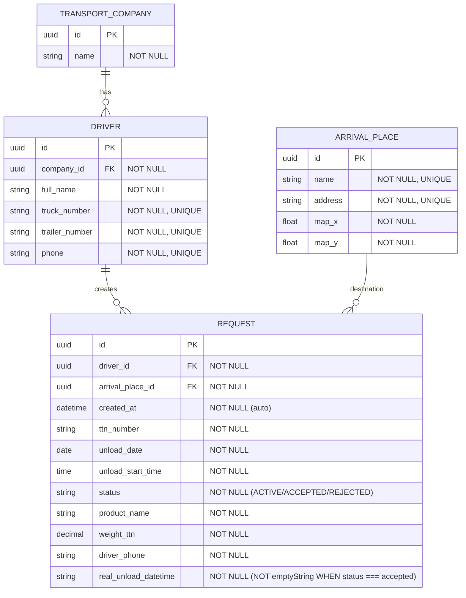

# It-innovo on Nuxt 4!

## Схема indexedDb базы данных:

```mermaid
erDiagram
    TRANSPORT_COMPANY ||--o{ DRIVER : has
    DRIVER ||--o{ REQUEST : creates
    ARRIVAL_PLACE ||--o{ REQUEST : destination

    TRANSPORT_COMPANY {
        uuid    id PK
        string  name "NOT NULL"
    }

    DRIVER {
        uuid    id PK
        uuid    company_id FK "NOT NULL"
        string  full_name "NOT NULL"
        string  truck_number "NOT NULL, UNIQUE"
        string  trailer_number "NOT NULL, UNIQUE"
	string  phone "NOT NULL, UNIQUE"
    }

    ARRIVAL_PLACE {
        uuid    id PK
        string  name "NOT NULL, UNIQUE"
        string  address "NOT NULL, UNIQUE"
        float   map_x "NOT NULL"
        float   map_y "NOT NULL"
    }

    REQUEST {
        uuid    id PK
        uuid    driver_id FK "NOT NULL"
        uuid    arrival_place_id FK "NOT NULL"

        datetime created_at "NOT NULL (auto)"
        string   ttn_number "NOT NULL"

        date     unload_date "NOT NULL"
        time     unload_start_time "NOT NULL"

        string   status "NOT NULL (ACTIVE/ACCEPTED/REJECTED)"
        string   product_name "NOT NULL"
        decimal  weight_ttn "NOT NULL"
        string   driver_phone "NOT NULL"

	string   real_unload_datetime "NOT NULL (NOT emptyString WHEN status === accepted)" 
    }

```
