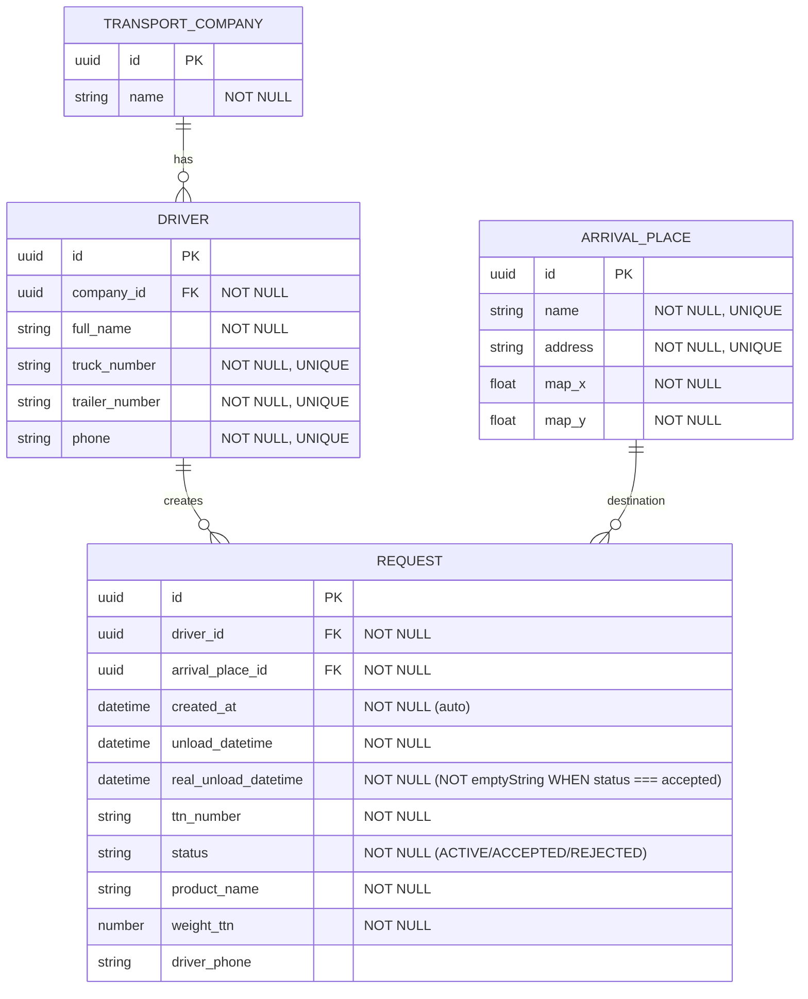

## Схема indexedDb базы данных:

```mermaid
erDiagram
    TRANSPORT_COMPANY ||--o{ DRIVER : has
    DRIVER ||--o{ REQUEST : creates
    ARRIVAL_PLACE ||--o{ REQUEST : destination

    TRANSPORT_COMPANY {
        uuid    id PK
        string  name "NOT NULL"
    }

    DRIVER {
        uuid    id PK
        uuid    company_id FK "NOT NULL"
        string  full_name "NOT NULL"
        string  truck_number "NOT NULL, UNIQUE"
        string  trailer_number "NOT NULL, UNIQUE"
	    string  phone "NOT NULL, UNIQUE"
    }

    ARRIVAL_PLACE {
        uuid    id PK
        string  name "NOT NULL, UNIQUE"
        string  address "NOT NULL, UNIQUE"
        float   map_x "NOT NULL"
        float   map_y "NOT NULL"
    }

    REQUEST {
        uuid     id PK
        uuid     driver_id FK "NOT NULL"
        uuid     arrival_place_id FK "NOT NULL"

        datetime created_at "NOT NULL (auto)"
        datetime unload_datetime "NOT NULL"
        datetime real_unload_datetime "NOT NULL (NOT emptyString WHEN status === accepted)" 

        string   ttn_number "NOT NULL"
        string   status "NOT NULL (ACTIVE/ACCEPTED/REJECTED)"
        string   product_name "NOT NULL"
        number   weight_ttn "NOT NULL"
        string   driver_phone

    }

```
